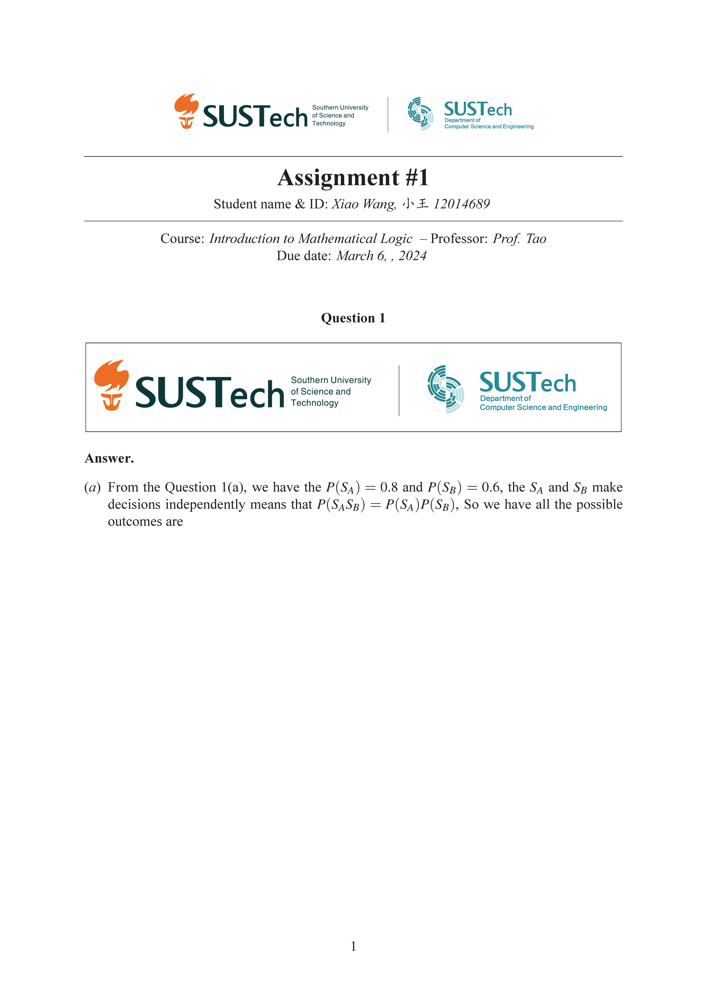

<!--Header and Introduction-->
# CS104_Assignments_template 

## Why this repo?

- This is a slightly revised template from the origin repo **[SUSTech_hw_template](https://github.com/zhuhu00/SUSTech_hw_template)** and it'll be mainly applied in my 2024 Spring Course ***Introduction to Mathematical Logic*** which recommends $\LaTeX$ form in assignments.

- Other templates of $\LaTeX$ SUSTech：[https://github.com/SUSTC/latex-template](https://github.com/SUSTC/latex-template)

<!--Thanks to them for the their functionalizing class file.
    And I hope to provide a trivial convenience for someone who find this repo.-->

## Others

- The expected render effect is showed as follows (built by `XeLaTeX chain`) :

- The *Logo* used in this template is from the official SUCTech CS Department website: [系标识.zip](https://static.cse.sustech.edu.cn/upload/images//upload/files/20240229/1709202951684416.zip) `组合4.png`

<!--This is an end-->
